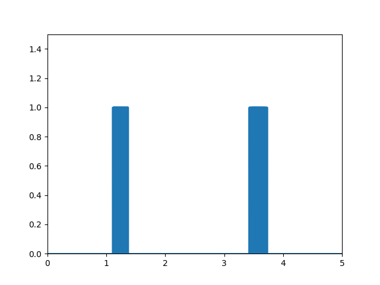
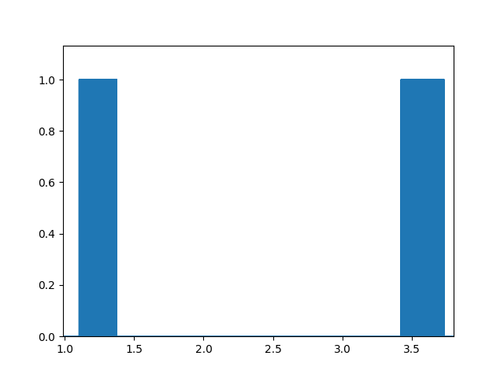
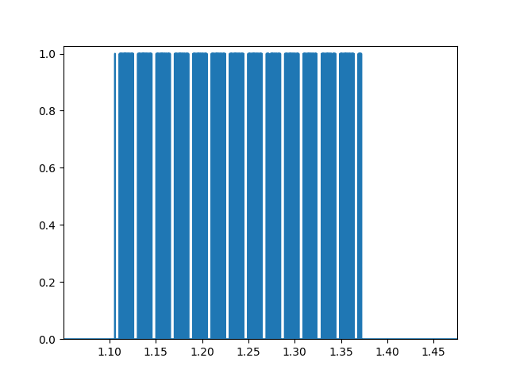
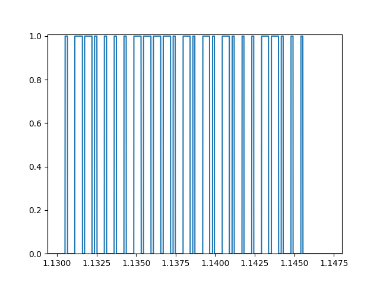
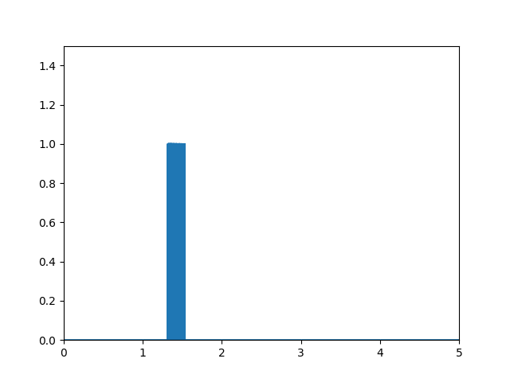
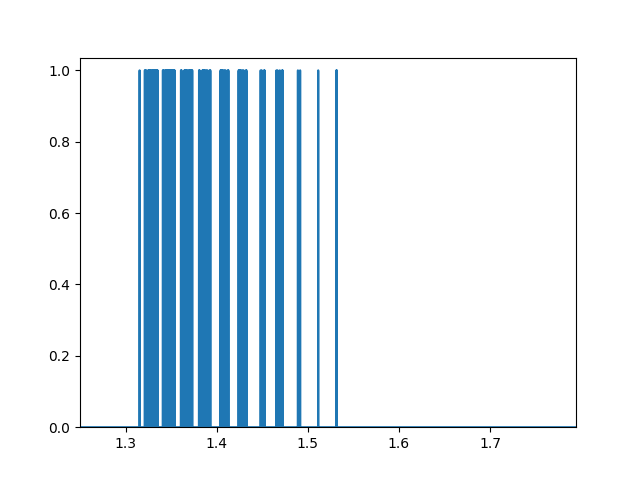
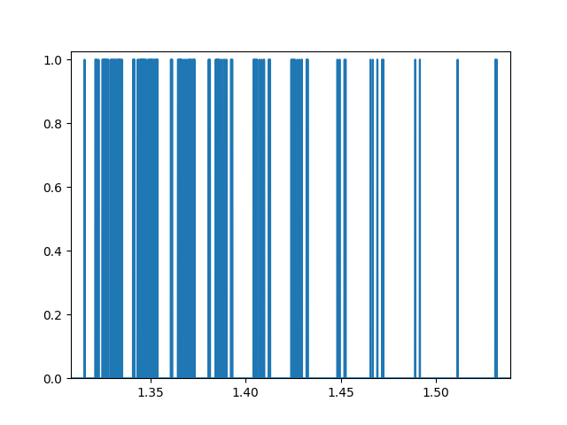
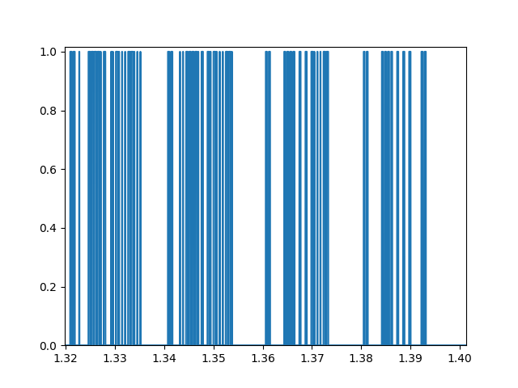
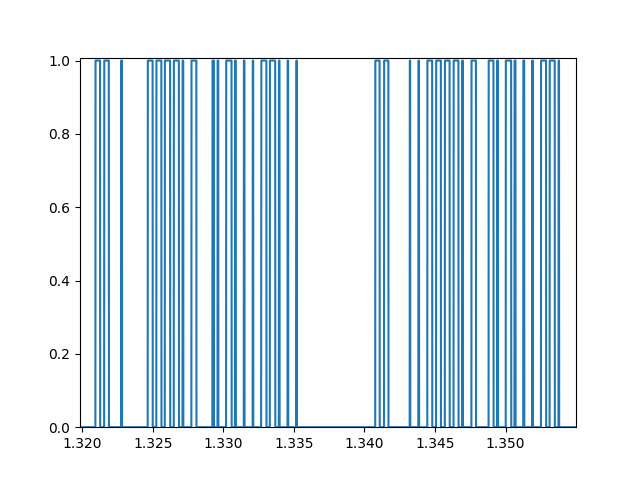

# radio-pi

The library enables RaspberryPi to integrate with radio-controlled devices (ie. power sockets).
The library was inspired by the tutorial: 

https://www.instructables.com/Super-Simple-Raspberry-Pi-433MHz-Home-Automation/


The library consists of two parts:

- `signal_receiver.py` is used with radio receiver unit to decode
  signal emitted by remote control,
- `signal_sender.py` is used for sending previously decoded signal
  with the usage of radio transmitter unit connected to Pi.

### Dependencies

The library has two main dependencies:
- RPi.GPIO to control the GPIO on a Raspberry Pi
- matplotlib to create signal plots
To install them use the file `requirements.txt`

## Reading a signal

Create an instance of the `SignalReceiver` class passing two arguments:

- `collecting_signal_period` to specify how long the sample should be collected.
- `file_name` file to which the signal is stored in json format.

To start calling signal use method `collect_signal` passing 2 arguments:
- `mode` which reflects numbering of the IO pins: `GPIO.BCM` or `GPIO.BOARD`
- `receiver_pin` to which radio receiver is connected.

Optionally you can use method `plot_signal` to see signal plot.

Signal properties (its value and duration) are written to a json file.

### Example

```python
signal_object = SignalReceiver(timedelta(seconds=5), "radio_signal.json")
signal_object.collect_signals(mode=GPIO.BCM, receiver_pin=22)
signal_object.plot_signal()
```

### Output file example
Signal is stored in a json file using the following format:
```json
{
  "signals": [1, 0, 1, 0, 1, 0, 1, 0, 1, 0],
  "durations": [0.0001679, 0.0047470, 0.0001689, 0.0004420, 
    0.0004740, 0.0001309, 0.0004750, 0.0001330, 0.0001519, 0.0004610]
}
```

## Sending a signal

Create an instance of the `SignalSender` class passing a single attribute:
- `signal_file` - file name with previously written signal by `SignalReceiver`.

Call method `run_transmitter` providing 2 attributes:
- `mode` which reflects numbering of the IO pins: `GPIO.BCM` or `GPIO.BOARD`
- `sender_pin` to which radio sender is connected.

### Example

```python
radio_waves = SignalSender("radio_signal.json")
radio_waves.run_transmitter(mode=GPIO.BCM, sender_pin=23)
```
### Examples of correct signal plots
Plots representing two signal pulses:



Repetitive signal pulse blocks indicate the correctness of encoded signals:


Zooming in the length of the zeros and ones becomes visible:


### Examples of incorrect signal plots
Plot representing a single signal pulse:


Zooming in non-repetitive tendency of signal blocks is visible:




